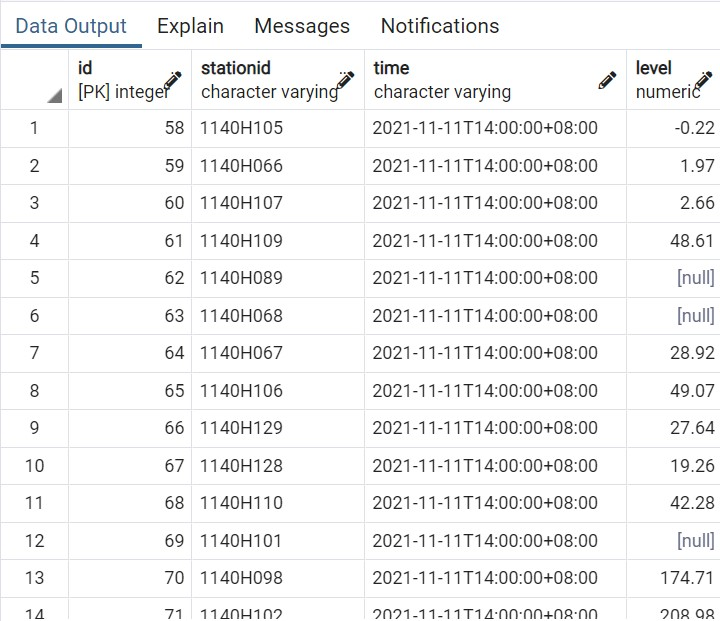
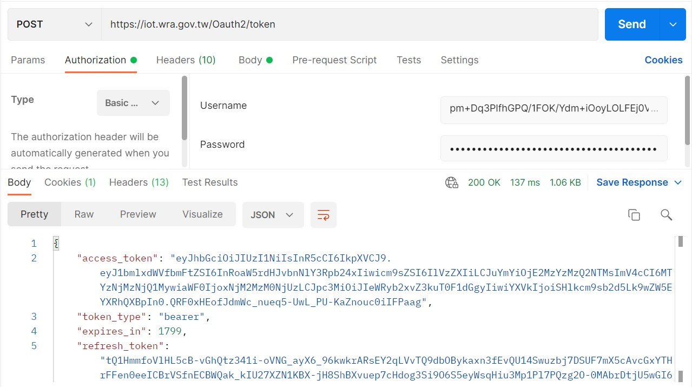
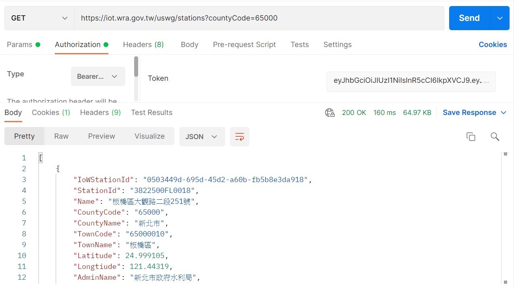

# **Flooding Sensor Crawler Project**

## **專案說明**
 
對比資料時間，相差二十小時以上即向資料網站發出請求取得token後，獲得淹水感知器資料。連接本地端postgreSQL資料庫，查找到每筆資料庫最新的資料，與api資料做對比，抓取資料進行更新。篩選出目標測站、計算時間差(十分鐘)，預設測試版本:所抓取的時間與現在時間相同，淹水深度隨機跑取10cm~70cm的數值範圍。連接Line Notify功能，定時推播達到示警的測站資訊。
 
 

## **環境說明**
 Windows 10 家用版；
 Python version 3.6.8

 

## **檔案說明**
 run.py 為撰寫之主要程式
 token.json 透過Postman取得的token
 notify.py 撰寫Line notify訊息
 notify_target.json 目標測站 
 log_result.json 顯示專案結果是否執行
 db.json 存放涉及隱私相關的資料；db_template.json為db.json的空模板
 run.bat 執行主程式之批次檔
 requirements.txt存放虛擬環境下所設的套件

 

## **成果說明**
 在PostgreSQL本地端資料庫匯入api取得的最新資料

 以Postman程式顯示提出請求獲取token

取得token後所抓取的資料型態

篩選後所取得的資料使用Line Notify功能，定時推播達到示警的測站資訊
![linenotifymessage]](./images/linenotify.jpg)
